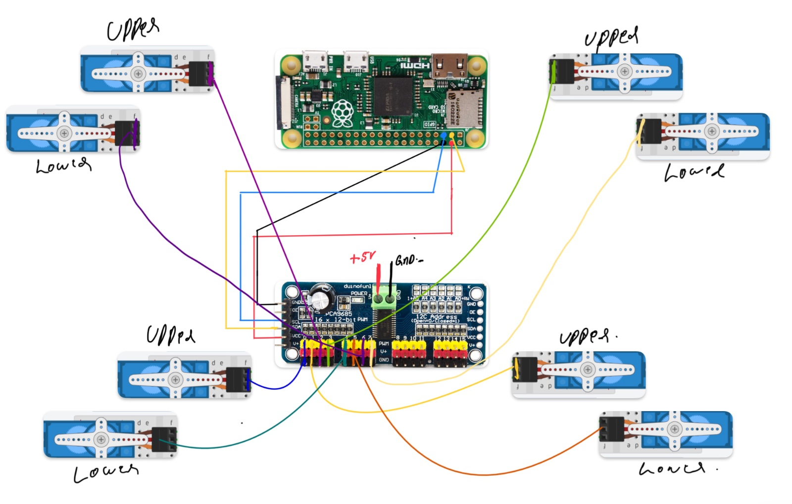

# Toby - Your Open-Source Robo Dog Project

Welcome to Toby, the Robo Dog project! This open-source endeavor provides you with everything you need to build your very own robotic companion. Whether you're a seasoned robotics enthusiast or a beginner, this guide will walk you through the process step by step.

## Overview

Toby is designed to be a fun and educational project, combining 3D printing, electronics, and programming. The project utilizes a Raspberry Pi Zero W and servo motors to bring Toby to life. Below, you'll find detailed instructions on how to build Toby from scratch.

## Components

Before you begin, make sure you have all the necessary components:

- Raspberry Pi Zero W
- PCA9685 servo controller
- 8 servo motors (MG90 SERVO)
- 3D printed components:
  - base.stl: 1 piece
  - gapper.stl: 16 pieces
  - leg1.2.stl: 4 pieces
  - leg2.stl: 2 pieces
  - leg3.stl: 2 pieces

## Building Toby

### Step 1: Setting up the Raspberry Pi

1. **Prepare the Raspberry Pi**: 
   - Download Ubuntu and flash it onto an SD card.
   - Insert the SD card into the Raspberry Pi Zero W and power it up.

2. **Setup SSH**:
   - Enable SSH on the Raspberry Pi.
   - Connect to the Raspberry Pi over SSH using the default username `pi` and password `pi`.

### Step 2: Installing Software

1. **Download Code**:
   - On the Raspberry Pi, navigate to the desktop folder.
   - Download the code files from the "code on Raspberry Pi" folder in your repository and place them on the desktop.

2. **Run Servo Script**:
   - Connect the servo motors to the PCA9685 servo controller.
   - Execute the `servo.py` script on the Raspberry Pi to calibrate the servos to a 90-degree angle.

### Step 3: Assembling Toby

1. **Assemble the Legs**:
   - Follow the provided diagram to assemble Toby's legs. After setting all the servo to 90 degree.
   
   - Attach the legs to the base using the gapper pieces.

2. **Connect Components**:
   - Connect the servo motors to the PCA9685 servo controller.
   - Ensure all connections are secure and wires are neatly organized.

### Step 4: Programming Toby

1. **Install Dependencies**:
   - Install `paramiko` library on your local system.

2. **Run `mainl.py`**:
   - Use the provided `mainl.py` script to control Toby.
   - Run the script on your local system.
   - Follow the prompts to make Toby walk, sit, stand up, wave, or stop.

## Using Toby

Once Toby is assembled and programmed, interact with him using the `mainl.py` script. Simply type commands like "walk", "sit", "standup", "wave", or "stop" to see Toby in action.

## Conclusion

Congratulations! You've successfully built Toby, the Robo Dog. We hope you enjoy this project and find it both educational and entertaining. Feel free to customize Toby and share your modifications with the community.

For any questions or assistance, refer to the documentation or reach out to the project contributors. Happy building!
